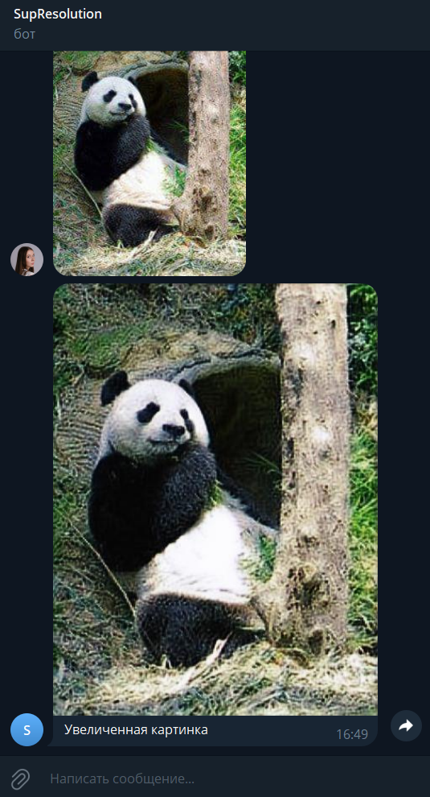

# Deep Learning (семестр 1, осень 2023)
## Итоговый проект 
___Image upscale tg bot___ - бот, которому можно отправить картинку, и он вернет ее в увеличенном виде.

Для запуска необходимо создать переменную окружения `TG_BOT_TOKEN` и запустить `python app.py`.

Скриншот:

